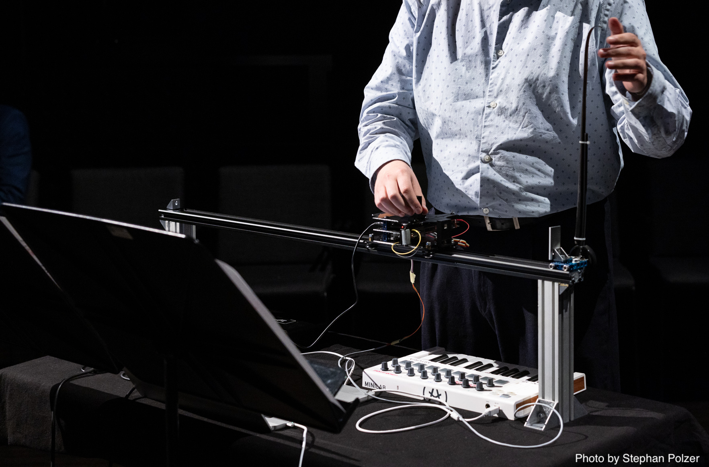
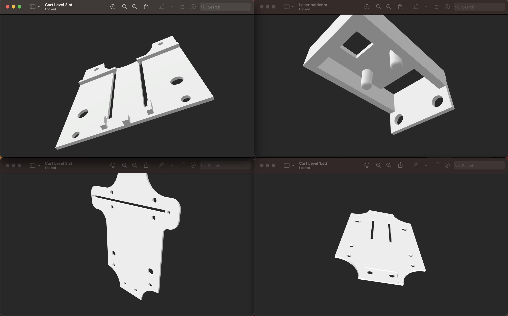
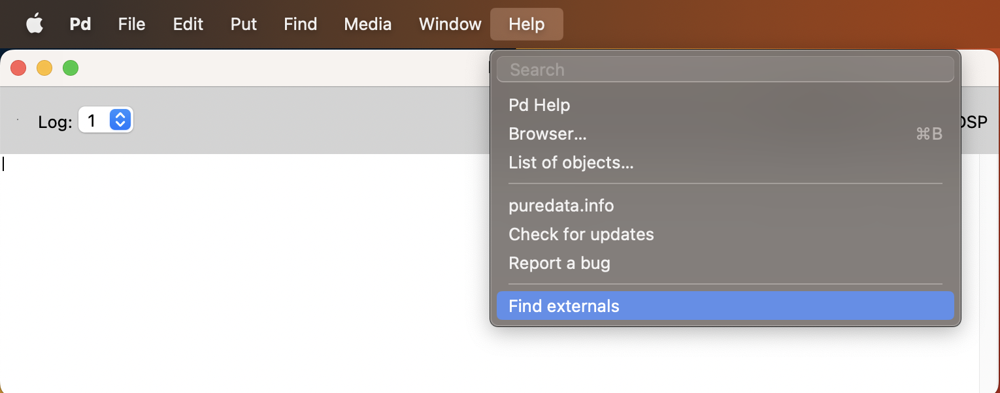
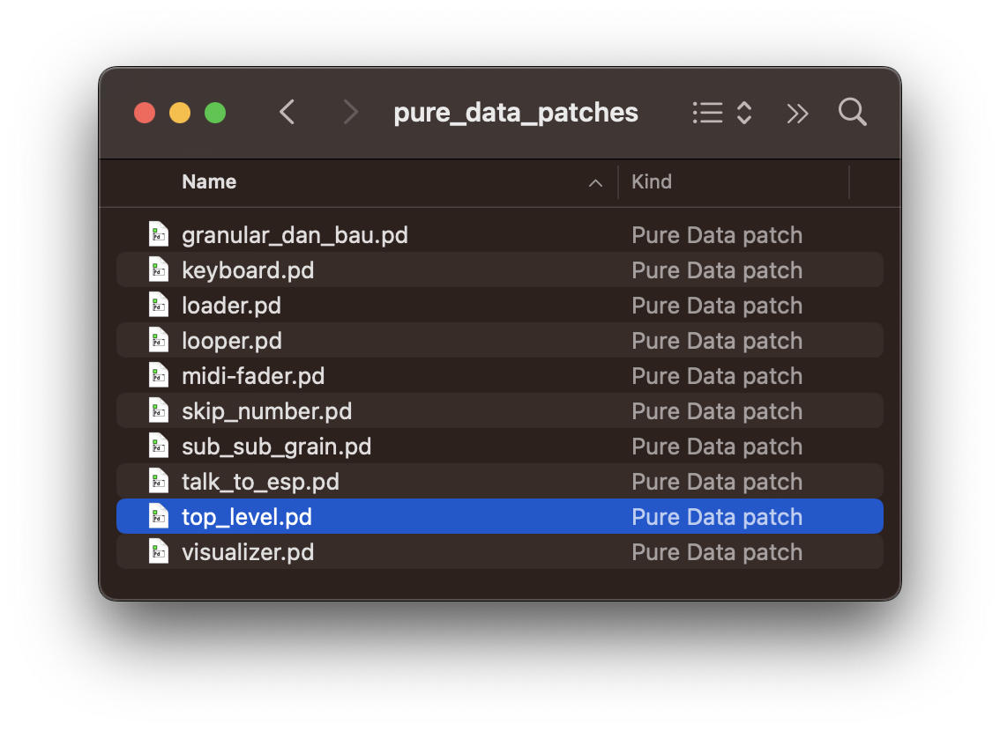
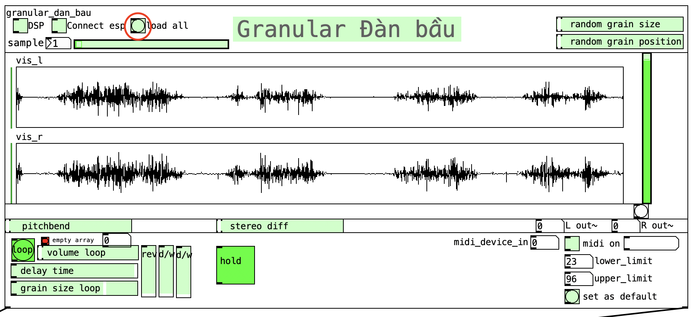
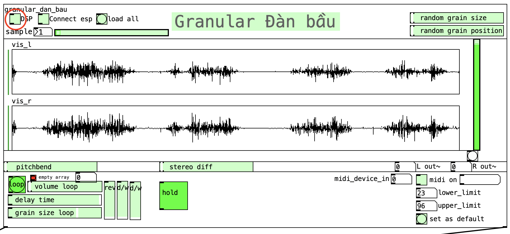
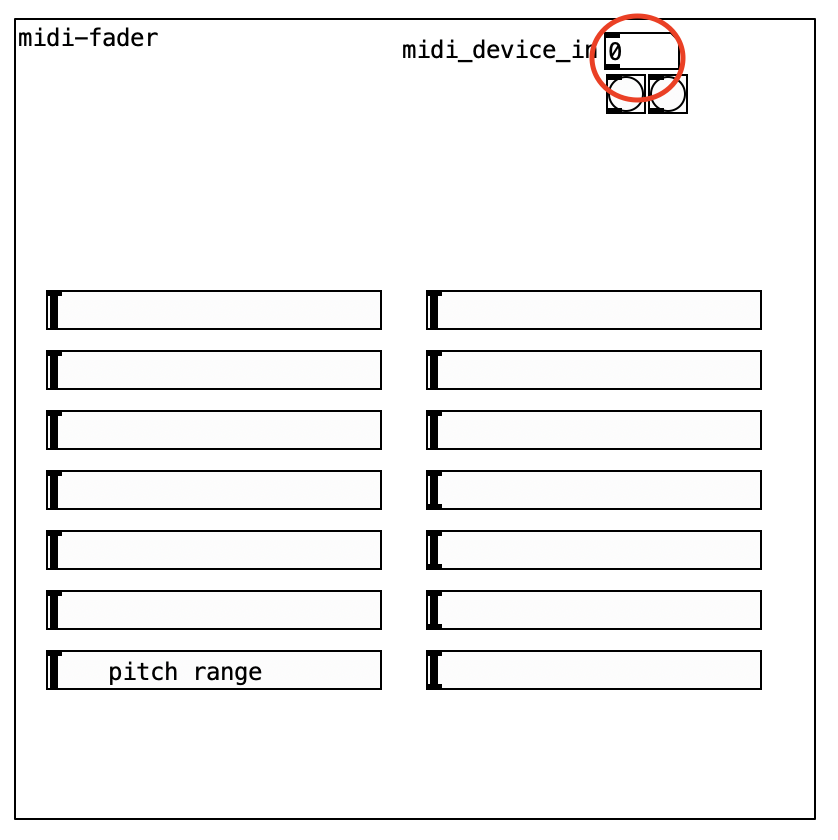
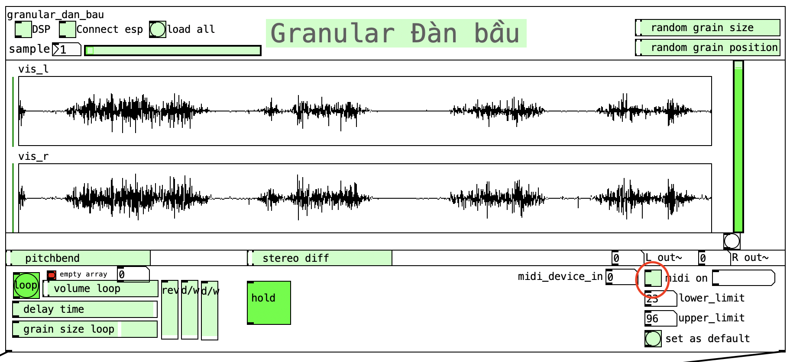

# Gran Bau

## Description
This project is part of my dissertation thesis.
It contains a granular synthesizer that is played via a custom physical interface based on the vietnamese instrument *dan bau*.
Alternatively it can be played using a MIDI keyboard.
Effects can be controlled via the provided GUI or using a MIDI keyboard with knobs/faders.

## Hardware
If you are planning on using only the keyboard version, you will only need a MIDI controller.

### Custom physical interface
The Gran Bau interface is based on the traditional vietnamese instrument *dan bau* and makes use of related playing gestures.
If you are planning on building the custom physical interface, there are several parts you need for it. These are the ones I used:

#### Microcontroller
* An [ESP32S3-Devkit](https://docs.espressif.com/projects/esp-idf/en/latest/esp32s3/hw-reference/esp32s3/user-guide-devkitc-1.html) or any other [CircuitPython](https://circuitpython.org)-ready microcontroller that has enough pins.

#### Sensor Units
* A copperfoil plate.
* A VL53L0X distance sensor unit, for example [this](https://shop.m5stack.com/products/tof-sensor-unit)
* A fader potentiometer.
* A rotary potentiometer.

#### Trolley System
The unit is built on top of a trolley system, which consists of two parts:
* A trolley
* A V-slot frame with a rail 

#### Housing
The housing is done with custom 3D prints. The STL-files can be found in the folder cart_stl.

## Installation
### Pure Data (PD)
To install, you will need a running version of [Pure Data](https://msp.ucsd.edu/software.html).
The following pure data externals are needed, if you are going to use the custom physical interface:

* comport
* cyclone/zl group
* cyclone/fromsymbol

You can find the comport external as well as the cyclone library via the menu bar:

* Help > Find externals

If you are planning on only using the keyboard version, you can skip the part for the custom physical interface.

### Custom physical interface
For the custom physical interface you need to have a microcontroller, which is able to run [CircuitPython](https://circuitpython.org).
The folder *code_esp32s3* contains the *code.py* file, which you to put on your CircuitPython microcontroller.
It also contains the *adafruit_CircuitPython_VL53L0X.py*, which you should put in the lib folder of your microcontroller if you want to use the ToF distance sensor.
Another library you might need is the [Adafruit Circuitpython Midi library](https://docs.circuitpython.org/projects/midi/en/latest/api.html).

## Usage

### General Usage
The fastes way to play is opening up the *top_level.pd patch*.
It contains the graphical interface of the patch *granular_dan_bau.pd* as well as a graphical keayboard visualizer called *keyboard.pd* and a midi slider representation called *midi-fader.pd*.
This patch contains everything for both the MIDI keyboard only version as well as the custom physical interface.

The button *Load all* loads up to 16 soundfiles contained in the folder *samples* into memory. You can choose a sample by dragging across the number box or double clicking and entering a number.
Another way is to use a secondary MIDI device, which will be discussed later. Make sure that all sound files inside the sample folder are called Sample#.wav, where # represents a number between 1 and 16.

Press the Enable DSP toggle in order to turn on DSP.

### Custom Physical Interface
If you plan to use the custom midi interface you need to do the following:

Press the *Connect ESP* toggle. This will enable the serial communication between the interface and the PD patch.

If you want to use a MIDI controller to controll the effects, for example switching between samples, you need to connect a MIDI controller, by changing the number box to the correct instance. If you only have 1 or 2 controllers connected, you can simply press the buttons below to choose the right one:

I used an Arturia minilab mkII to controll the synthesis parameter using the rotary knobs.
| Controller No.  | 74             | 71            | 76             | 77            | 93             | 73            | 75             | 18               | 19              |
| -------------   |:-------------: |:-------------:|:-------------: |:-------------:|:-------------: |:-------------:|:-------------: |:----------------:|:-------------:  |
| Parameter       | Volume of Loop | Grain Size    | Reverb Amount  | Dry/wet Loop  | Dry/Wet Direct | Stereo Diff   | Pitch Range    | Random Grain Size| Random Grain Pos|

The MIDI notes 48, 52 and 55 are used to select the previous soundfile, select the next soundfile, and to start the looping effect.

### Midi keyboard ONLY
If you plan to use the MIDI keyboard version without the controller, make sure to check the toggle and select the right MIDI keyboard.

Instead of using the cart to scroll through the sample, use the keys of the MIDI keyboard.
Do not forget that the MIDI notes 48, 52 and 55 are used to select the previous soundfile, select the next soundfile, and to start the looping effect in addition to playing back from positions inside the sample, but you can change that inside *granular_dan_bau.pd* > *pd sample_pick_keyboard*.
If you want to spread the sample position across your keyboard, you can set the lower_limit and upper_limit number boxes to the lowest and highst midi notes you plan to use.

## Support
This repository is maintained by [me](https://github.com/grundton).
For questions and feedback feel free to reach out to me!

## License
TO DO, also license for samples 

## Project status
In development

